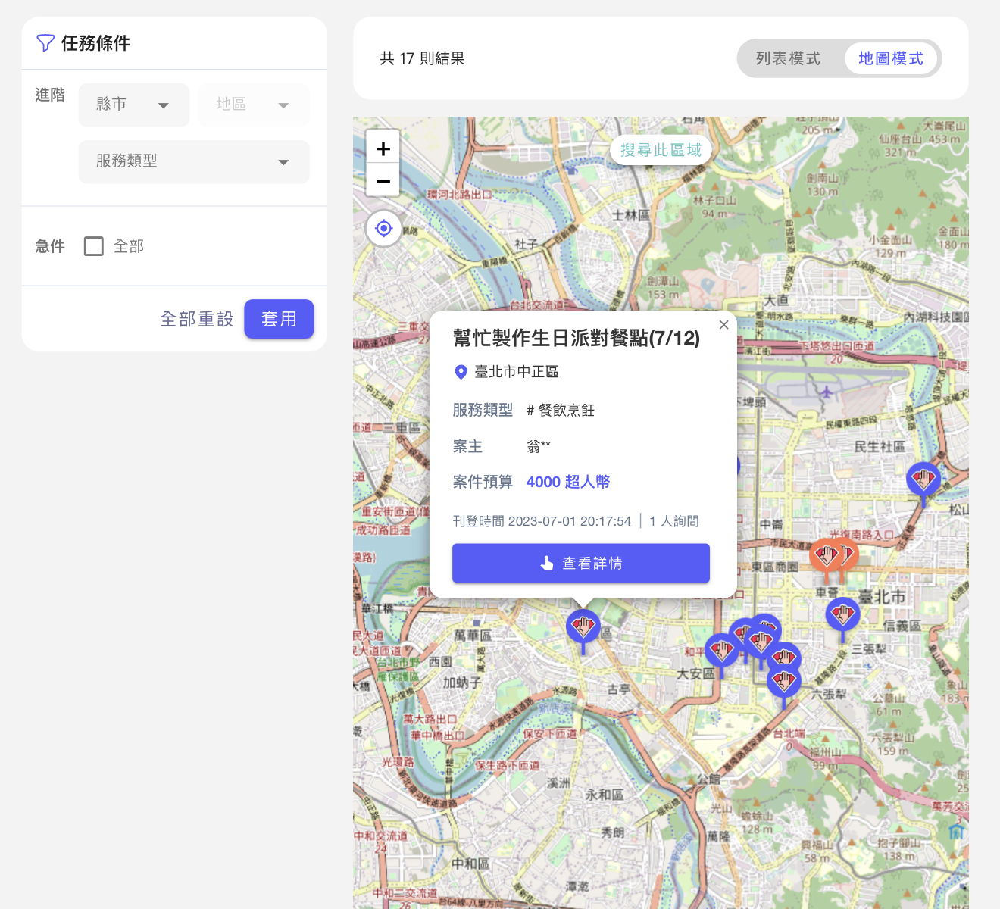
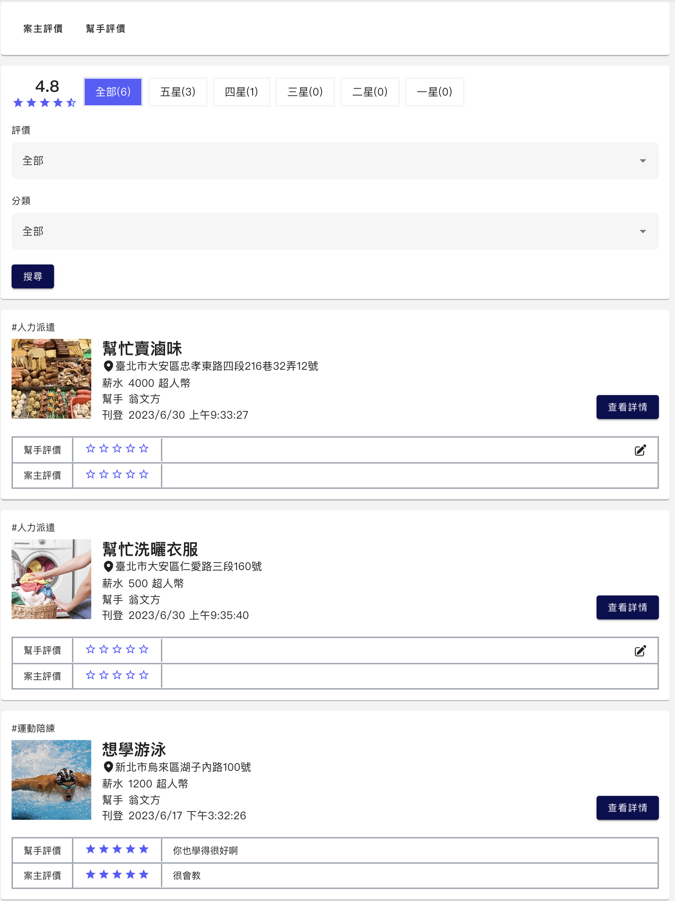
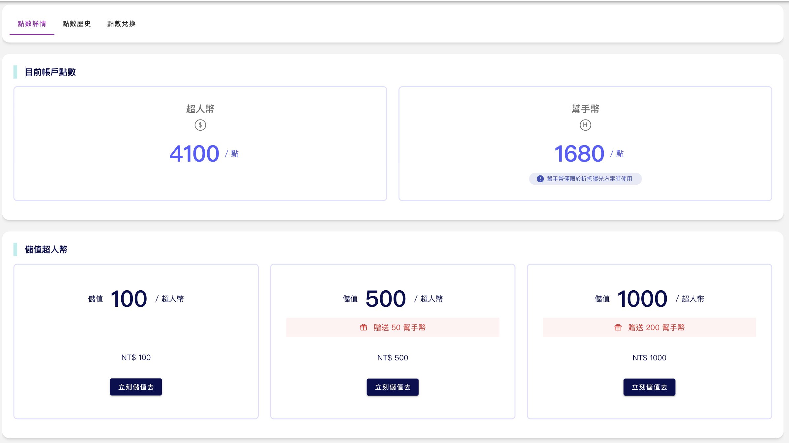
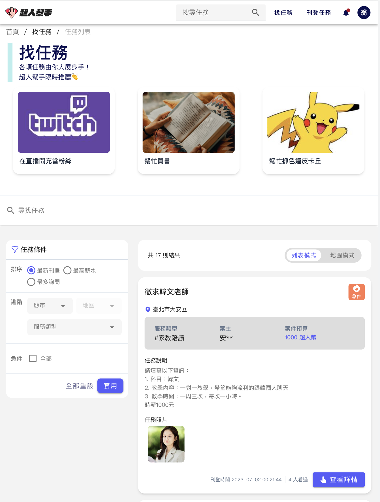
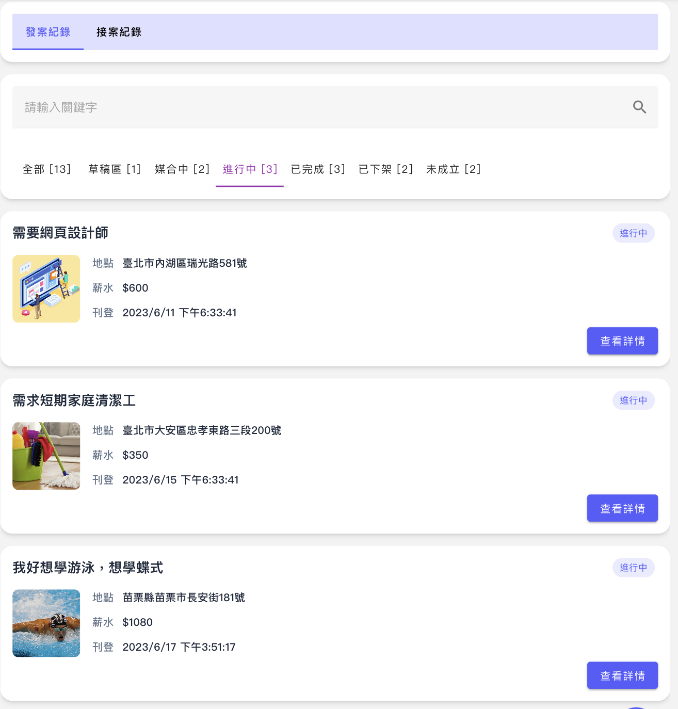
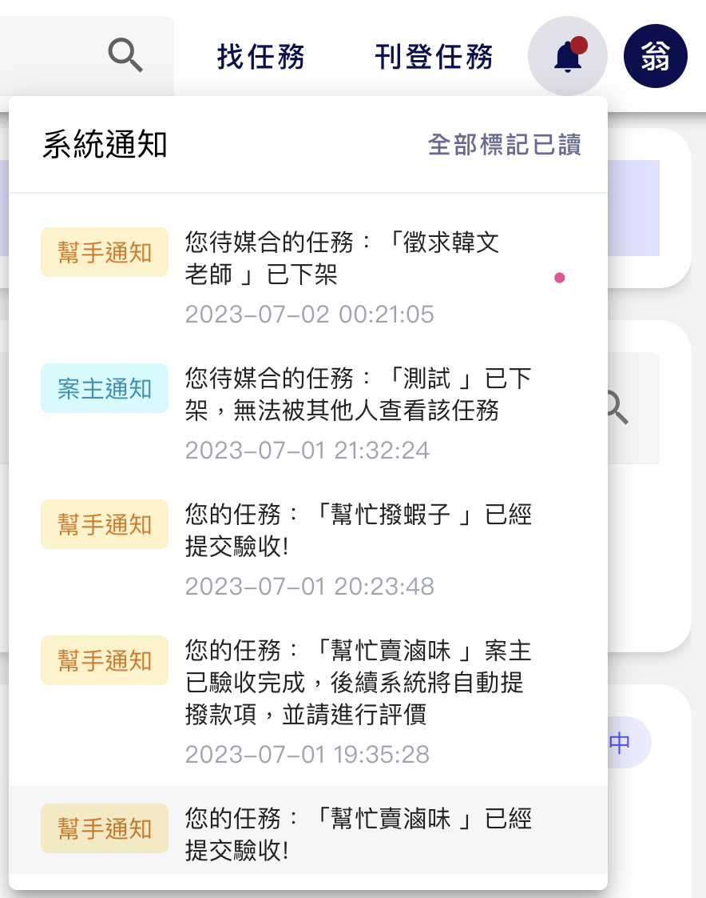
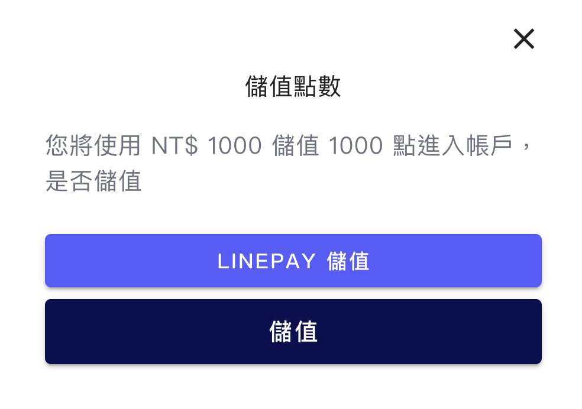
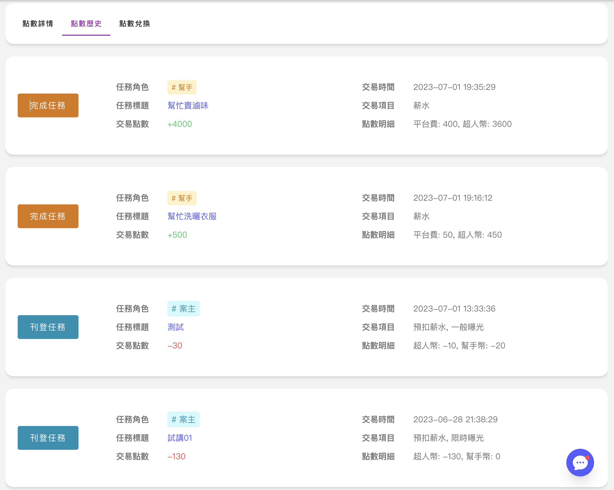

<p align="center">
  <a href="./README.md"> English </a> | <a href="./README.zh-TW.md"> 繁體中文
  </a>
</p>
  
<p align="center">
  Developed by Taipei Group 3<br></a>
<br>

</p>

# SuperHandy-backend

"Our mission is to empower individuals with superhuman abilities in their daily lives. This philosophy represents our commitment to providing a platform that makes it easy for users to find tasks they need help with, while also inspiring them to feel like superheroes who have the power to help others and increase their own self-worth."

## Preview

[Launch Live Preview](https://superhandy-frontend-fork.herokuapp.com/)

## Special Features
1. Map GPS location search


2. Chat room function


3. Skill rating system


4. Provide value-added services for members' points


## Other Features
1. Find Tasks


2. Tasks Management


3. Notifications


4. Transaction



## System Architecture


## Getting Started

-   (1) Create the `config.env`. (You can get copy from `example.env`)
-   (2) Run the npm install.
-   (3) Depends on your environment and follow the script below.
-   (4) You can get [swagger-doc](http://localhost:3000/api-doc/).

```
// development
npm run dev

// production
npm run prod

// swagger docs
npm run swagger

```
