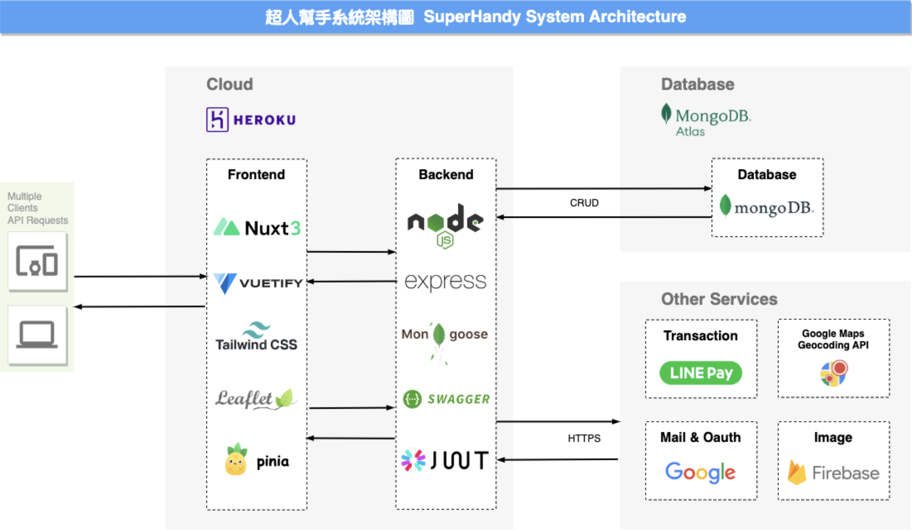

<p align="center">
  <a href="./README.md"> English </a> | <a href="./README.zh-TW.md"> 繁體中文
  </a>
</p>
  
<p align="center">
  Developed by Taipei Group 3<br></a>
<br>

</p>

# SuperHandy-backend

"Our mission is to empower individuals with superhuman abilities in their daily lives. This philosophy represents our commitment to providing a platform that makes it easy for users to find tasks they need help with, while also inspiring them to feel like superheroes who have the power to help others and increase their own self-worth."

## Features
1. Map GPS location search
2. Chat room function
3. Skill rating system
4. Provide value-added services for members' points
## System Architecture


## Getting Started

-   (1) update the config.env for mongo DB
-   (2) Run the npm

```
// development
npm run dev

// production
npm run prod

// swagger docs
npm run swagger

```

-   (3) [swagger-doc](http://localhost:3000/api-doc/)

## Deploy on Production
