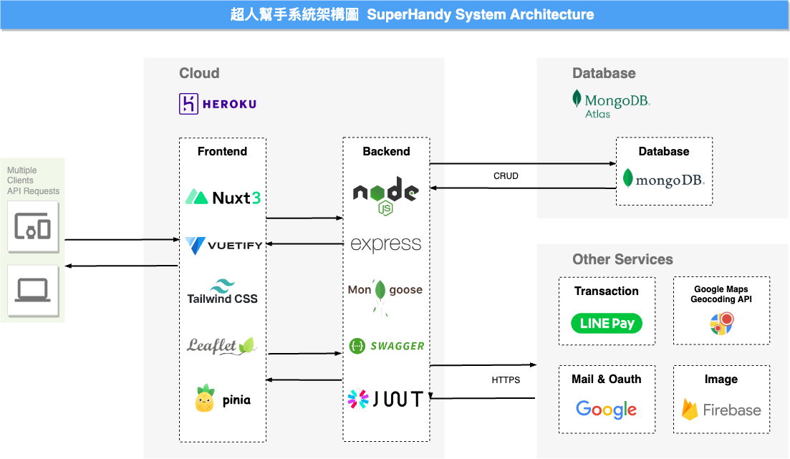

<p align="center">
  <a href="./README.md"> English </a> | <a href="./README.zh-TW.md"> 繁體中文
  </a>
</p>
  
<p align="center">
  北三組共同開發<br></a>
<br>

</p>

# SuperHandy-backend

「讓您在生活中擁有超人的力量」。這個理念代表著我們的使命是提供一個平台，讓使用者可以輕鬆地找到需要幫助的任務。同時，我們也希望讓使用者感受到自己像超人一樣有能力去幫助別人解決問題，實現自我價值的提升。  

## 系統架構



## 快速開始
- (1) 於 config.env 設定 mongo DB 參數
- (2) 執行 npm 
```
//開發環境
npm run dev

//正式機環境
npm run prod

//Swagger開發文件
npm run swagger

```
- (3) [swagger-doc](http://localhost:3000/api-doc/)

## 部署正式環境

